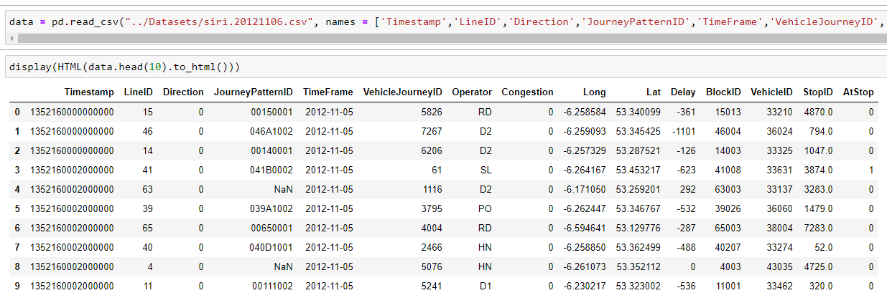
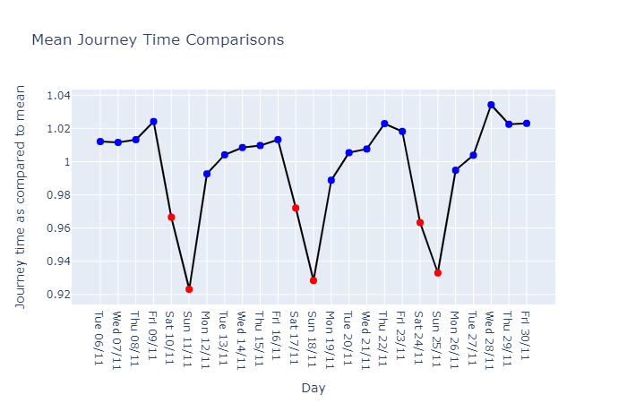
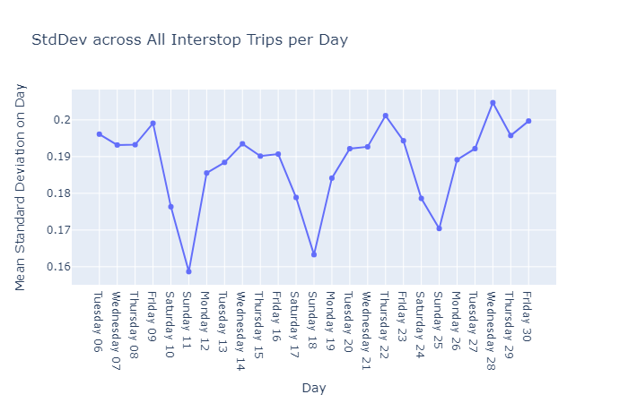
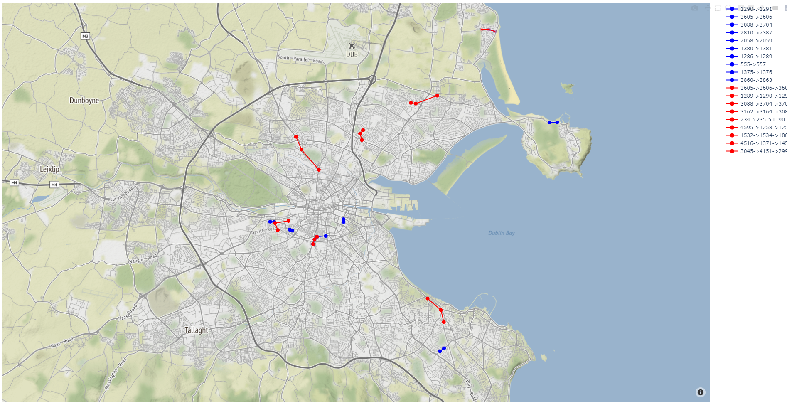
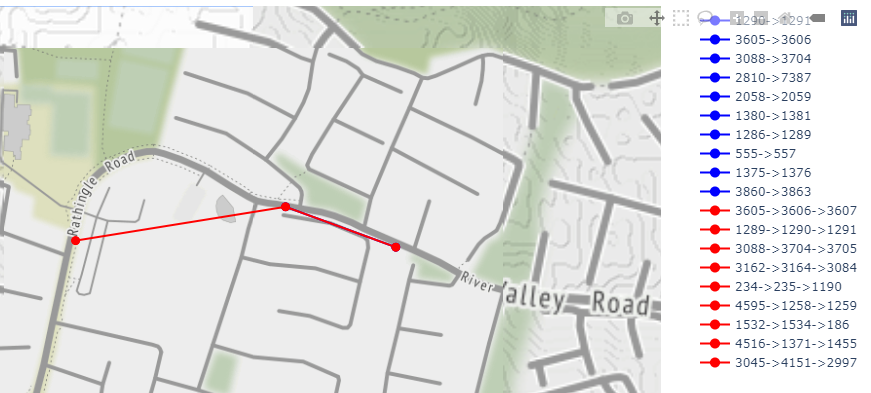

# A Data Analysis of Bus Journey Variability in Dublin

The following project is a data analysis of GPS data points from Dublin Buses over a 24 day period in November 2012.

The aim of this analysis was to transform the raw data into some form of human readable metrics from which conclusions could be drawn and comparisons made regarding the Journey Time Variability and performance of Buses in the Dublin Area.

The raw GPS data is taken and turned into information regarding the travel times between stops across the city. This information is then used to generate statistical metrics regarding the performance of all journeys on a stretch-by-stretch basis. The primary metrics used were mean travel time for a stretch and the Standard Deviation for all journeys on a particular stretch.

Using the generated statistics visual representations of these statistics were produced to allow comparison between various stretches and across days during the sample period.

## Nomenclature and Terms

The below table details some of the terms used in the project and a brief explanation of what is referred to by these terms. The usage of these terms is so as to avoid repetition of complex descriptions of commonly referred to concepts

| Term | Definition |
|-- | --|
|Datapoint| A GPS ping within the original dataset |
|Stretch| A section of route between stops i.e. Stop A to Stop B |
| Interstop Journey | A particular vehicle journey along a stretch |
| PairStop Journey | A particular vehicle Interstop Journey which has only two stops in a stretch |
| MultiStop Journey | A particular vehicle Interstop Journey which has more than two stops in a stretch |
| Normalise | The term normalise has been co-opted in this case to refer to expressing all values in a similar range instead of the traditional definition of representing all values as values between 0 and 1 |

---

## 1 Introduction

When evaluating the performance and effectiveness of bus operations, historical tendencies has been to examine performance through metrics such as reliability, punctuality and overall travel time. Measuring travel time is a well established practice and is straightforward in terms of the ability to measure and define it. However, there is an important case to be made for including the level of Journey Time Variability as a metric by which performance is measured.
> "Reliability of travel times is increasingly recognised as as major network characteristic that should be recognised when considering investment options"(1)

Dictionary definitions for Variability describe it as a "lack of consistency", which is of importance to a commuter as inconsistent journey times interfere with the commuters ability to properly plan journeys. If a journey has a poor degree of consistency the commuter is forced to incorporate extra time into their commute to accommodate for potential delays. A paper, commissioned by the Danish Department of Transport(2), was written to try and establish a formalised definition of Travel Time Variability and comment on the effects of Travel Time Variability on the individual commuter and the economy as a whole.

> “travel times also become more variable and unpredictable as congestion increases. From the point of view of the traveller, it becomes hard to predict for instance how long the commute to work will take. This uncertainty entails additional costs to travellers and hence to society. It is relevant and necessary to include these costs in the economic evaluations of transport policies, especially those policies that are directed against reduction of travel time variability” (2)

Using this paper as the inspiration this project was intended to similarly find a method to transform raw GPS data logs(3) published by Dublin City Council into useful metrics by which the variability of buses throughout Dublin could be measured. These generated metrics could then be turned into easily human readable plots which would illustrate patterns and problems regarding variability of Journey Times in the Dublin area over an extended period of time. The hope from this is that the illustrated patterns could be used to 1 inform decisions for the improvement of the quality of bus services within the city by highlighting what causes poor performance.

### 1.1 Tools and Technologies Used

- Python
  - Pandas: Pandas is a ubiquitous tool for data processing tasks with Python. It facilitates easy reading and writing of CSV files and its DataFrame object type is perfect for manipulating data in these formats.(4)
  - Plotly: Plotly is a JavaScript library for creating graphs and plotting data. It also has a Python library which allowed for direct integration with the scripts used to manipulate the data. All the plots and maps I created were made using this library.(5)
  - Jupyter Notebook: Jupyter Notebook is a web application that allows the execution of live code within a browser and saves checkpoints of the execution. This makes them perfect for trying to visualise data when acclimatizing to it. By using the cells system the data being worked on could be visualised through execution and adjustments made to it without having to run the whole script again.(6)
- JavaScript   - A JavaScript API called ‘dublinbus-client’ was used to obtain accurate GPS coordinates of bus stops’ locations for plotting purposes.(7)

### 1.2 Personal Motivations

As a commuter in the Dublin Area I have a personal impression of the performance of Dublin Bus. For the duration of my time attending Trinity College I elected to take alternative methods of transport instead of the bus as the inconsistency of journey times and the unreliability of arrival at my local stop meant that I could not rely on the bus to get me to my destination in either a timely or predictable manner. This therefore rooted the issue of Time Travel Variability as one which affected my everyday routine.

### 1.3 Structure of Report

#### 1.3.1 Background Literature Chapter

This Chapter discusses the existing literature regarding the topic of Journey Time Variability. In this chapter key terms are defined in terms of current practice and a methodology is researched based on current practices.

#### 1.3.2 Data Chapter

The Data Chapter will discuss the raw format of the data, issues with the data, the methodology used to analyse data and efforts to speed up execution of the scripts.

#### 1.3.3 Plots Chapter

In the plots chapter, the data generated in the previous stage is turned into various plots from which it is hoped that conclusions and observations can be made regarding transport performance in the Dublin area as a whole.

The data generated in this previous section will be utilised in various ways to generate a variety of visual representations in order to present a diverse picture of performance. The plots created show the change in journey time and journey variability across the sample period, a comparison of variability on a day by day basis, comparisons of stretches of various lengths to identify if high variability in small sections has significant impact on longer stretches.

#### 1.3.4 Reflection and Evaluation

The Reflections and Evaluation chapter looks back on the project and discusses and critiques the methodology used in the project. This section will look both at the technical implementation and the statistical analysis performed to judge the success and reflect on potential areas of improvement.

In addition further work or steps which could be carried out in the future to develop the value of this project and to address some of the limitations caused by decisions made previously will be identified here and a tentative roadmap for proceeding will be created.

#### 1.3.5 Conclusions Chapter

## 2 Background Literature

### 2.1 Variability and Reliability Terminology

According to Fosgerau et al.(2) the value of variability and the value of reliability are often used interchangeably, this is further supported by other examples of literature using this terminology in this manner such as "Improving Reliability on Surface Transport Networks"(1) a report created by the OECD.

### 2.2 Valuation of Reliability

Reliable and predictable travel times have an economic and social value to the commercialactivities and to the commuter. To the commuter Time Travel Variability necessitates theconsideration of safety margins into their planned commute if they are to ensure that theycan arrive to their destinations in a timely manner. According to Jonas Eliasson in his Paperabout Car Drivers Valuations of Variability:

> "Travel time variability is the random, day-to-day variation of the travel timethat arises in congested situations even if no special events (such as accidents)occur. If congestion is severe, this variation may be significant. The unreliabilitymeans that many travelers must use safety margins in order not to be late. Insome cases, the margin will turn out to be insufficient, and the traveler will belate nevertheless." (8)

From a commercial aspect the disutility of a Commuter being late is the loss of productivityfrom lost work time. As a Commuter the impact of variability is seen from a socialstandpoint, having to factor in a greater margin of error when planning commutes amountsto lost time prior to departure in order to ensure arrival on time at the destination.

Time spent travelling has an established monetary equivalent in economic appraisals, thespecific valuation of minutes spent traveling to currency varies from region to region andrelevant local authorities will have their own figures. Attention must be drawn however tothe valuation of travel time variability . This is defined by a minutes standard deviation divided by the value of travel time, this metric is commonly referred to as the reliabilityratio(2). Reliability Ratios express the relative valuation of standard deviation to travel time.The valuation is expressed in this manner in reference to the valuation of a minutes traveltime such that if the valuation for travel time should change then the valuation of variabilityremains consistent with it. Eliasson(8) provided the following table, reproduced in Table 2.1,with the Reliability Ratios obtained by a variety of studies:

Table 2.1: Reliability Ratios Obtained from Prior Studies

| Study | Reliability ratio | Remark |
| --- | --- | --- |
| Abdel-Aty et al. (1995) | 0.35 | According to Small et al., 1995 |
| Black and Towriss (1993a) | 0.55 | According to Cohen and Southworth, 1999|
| Black and Towriss (1993b) | 0.79 | According to Bates et al. (2001)|
| Noland et al. (1998) | 1.27 | According to Noland et al. (2001)|
| Lam and Small (2001) | 1.3 ||
| Small et al. (2001) | 1.3 ||
| Bates et al. (2001) | 1.1 – 2.2 | Claims (without reference) that this is “typical values from the literature”|
| Rietveld | 2.4 | Public transit with long headways|
| Black and Towriss (1993a) | 0.70 | All modes and trip purposes|

Additionally Fosgerau et al. suggest that a 1 minute delay is approximately equal to between 1.5-2 minutes of regular travel time.(2)

The relevance of Reliability Ratios states that there is an economic impact to highly variable travel time. This economic impact justifies the inclusion of Reliability and variability into consideration when developing models for the appraisal of transport efficiency.
> "A relationship between time travel variability and specific traffic demand related variabilities calculated or used as input by the existing models can be developed for policy measures that are being appraised. By means of further basic research onto the relationship between travel time reliability and the demand related variables used in the model the capacity of these simple tools can be enhanced" (1)

<!-- -->
> "Reliability of travel times is increasingly recognised as as major network characteristic that should be recognised when considering investment options" (1)

This therefore demonstrates the value for the gathering of reliability/variability data on a transport network as this report sets out to do.

### 2.3 Measuring Variability

To measure the variability is it necessary to select an appropriate metric. According to the United Kingdom’s Transport Analysis Group(9) for the purposes of private vehicles:

> "Variability can be measured by the standard deviation of journey time at agiven time of day, or by the coefficient of variation (CV) which is defined as theratio of the standard deviation of journey time to the average journey time. Either measure can be used when appraising proposals to improve the reliability of private vehicle travel."

The same report goes on to discuss measuring public transport and states that due to only 25% of passengers being aware of predictable variation that all variation should be regarded as unpredictable. In this report because measurements are done on vehicle journeys and not passenger journeys bus journeys will be treated like private vehicles. As such the standard deviation from mean journey time is an achievable metric to measure given the data available. This assertion is further reinforced by Fosgerau et al. who recommend it on the grounds:

> "Finally, the standard deviation is comparatively simple to measure and predict. It is hard to conceive of a simpler and more straight-forward measure of travel time variability. It is hence the easiest measure to compute from traffic models."(2)

The usage of standard deviation of journey times is also not without precedent as it is an established measure already in use according to the OECD report(1) in:

- the United Kingdom
- The Netherlands
- New Zealand
- Australia
- Sweden

Given these facts it is logical to use Standard Deviation of Journeys from Mean Journey Time as the primary metric for this study.

## 3 Data

### 3.1 Format of Raw Data

The dataset in use is sourced from Dublin City Council(3). There are two datasets to choose from one of data gathered in November 2012(10) and a second gathered in January 2013(11). This project will focus on the dataset from November however, the techniques used are applicable to January as well.

The dataset consisted of 24 individual files formatted in a CSV format. Each CSV file corresponded to an individual day in the time period. The data is divided into calendar days starting at 00:00 each day and ending at 23:59, attention is drawn to this fact as Dublin Bus’ timetable operates between 06:00 and 03:00 meaning it is not aligned with the dataset’s days.

In each individual day each line corresponded to an individual ping from a vehicle. Each ping contained:

- information regarding the time at which the ping was sent - information regarding the vehicle which sent it - the route the vehicle was operating on - the position of the vehicle both in the geographically - the position along the route it was traveling.

Figure 3.1 shows an excerpt of the raw data as seen in a Jupyter Notebook.


Figure 3.1: Example of Data in raw format

Below is the key for columns of the data as provided by Dublin City Council at the source of the data(3)

0. Timestamp micro since 1970 01 01 00:00:00 GMT,
1. Line ID,
2. Direction,
3. Journey Pattern ID,
4. Time Frame (The start date of the production time table - in Dublin the production time table starts at 6am and ends at 3am),
5. Vehicle Journey ID (A given run on the journey pattern)
6. Operator (Bus operator, not the driver),
7. Congestion \[0=no,1=yes],
8. Lon WGS84,
9. Lat WGS84,
10. Delay (seconds, negative if bus is ahead of schedule),
11. Block ID (a section ID of the journey pattern),
12. Vehicle ID,
13. Stop ID,
14. At Stop \[0=no,1=yes]

For the purposes of this project not all data columns are relevant or of use. To obtain times between stops only the following are needed: _VehicleID, Vehicle Journey ID, Timestamp, At Stop_ and _StopID_, however in order to enable some future proofing other columns were carried through the processing stage in case other measurements are taken later on in the process and by having these columns included means the data does not need to be processed again.

### 3.2 Processing of Data

An initial attempt was made to use the _VehicleJourneyID_ column to segregate the data into separate journeys, unfortunately this value is not unique to a journey within the global dataset as multiple vehicles on multiple routes could use the same ID simultaneously. As such it is necessary to isolate each vehicle in the data-set and then extract every journey it did.

In addition to the non unique journey IDs the data-set has further imperfections. When examining the data it is discovered that not all journeys were recorded correctly. Some journeys were recorded with some fields missing, such as the route being served or featured a value of NaN.

Other Journeys were only partially recorded, this could be due to the journey having started the day prior to the time period being examined (as referenced above regarding the misalignment of the dataset days with timetable days) or due to human error where a journey was simply recorded as finished before it should have been.

Due to the fact that journeys can not be guaranteed to be completely recorded the intended approach was adapted from looking at journeys as a whole to instead looking at smaller sections of the journey. In this case Stretches were defined as journeys between particular stops. In addition to being more suited to the data available this more granular approach had the advantages that:

1. by being agnostic to the route a bus was operating on data could be amalgamated from multiple routes running between the same stops.
2. by focusing only on stretches of journeys problem areas of the city would be directly identified. This is superior to finding problematic routes and attempting to draw conclusions regarding sections of routes.

As such a methodology for processing the data-set into meaningful information is established. The time taken to travel between any particular pair of stops on a route is measured and this is recorded to a file, additionally the time it took to make a journey between multiple stops in a sequence i.e. 3 stops in a row or more is also recorded to try and identify if a stretch between two stops was problematic in isolation or as part of a larger area.

#### 3.2.1 Methodology

The processing of data has four stages:

1. Creation of _Interstop Journeys_: As mentioned above, in the data-set _VehicleJourneyID_ is not a globally unique value, instead it is only unique on a per vehicle basis. Therefore to identify a unique journey the data must first be segregated by vehicle, then split the data into each journey taken by the vehicle in the sample time. Once a standalone journey has been obtained take each stop and get the time it takes for the vehicle to reach the next stop and record this in the new DataFrame. If examining multi-stop journeys get the time to the next stop again and record that instead. Once the whole day is processed this created DataFrame is written to a CSV file. This is used by another script to generate statistics based on the aggregated Interstop Journeys which were just created.
2. Normalisation: It is important to note that the Interstop Journeys can vary widely in terms of distance between stops. Therefore the journey times between particular sets of stops will also vary significantly. In order to compare data on a like for like basis it is necessary to Normalise the data in such a way that they can be compared fairly. Therefore the Interstop Journey times are taken and re-expressed as a ratio of the mean for that stretch on that day. With all data being expressed in terms of similar magnitudes the Standard Variations can be compared on a like-for-like basis more meaningfully.
3. Generation of Metrics: Once journey times have been normalised in this manner then the Standard Deviation for each stretch is obtained. The Standard Deviation for a stretch is obtained by getting all rows of the Pandas DataFrame referring to that that stretch and using the inbuilt Pandas function to derive the Standard Deviation for the Journey Duration Column. The Standard Deviations for all stretches are once again recorded in a DataFrame and stored in another CSV file.
4. Visualisation: This file is read from and its contents used in the generation of the plots and maps shown and discussed later in Chapter 4

#### 3.2.2 Multi-threading

The entire data-set for this project is 24 days worth of data. On one single day (6/11/12) there are 1,765,912 data points. To obtain the data each vehicle must be isolated, then for each journey made by this vehicle each sequential pair of stops is obtained and the time between them recorded. While many data-points could be ignored as they are irrelevant pings while the vehicle is in transition between stops there is still a large volume of data to be analysed on each day.

In a single threaded script it took approximately 90 minutes just to obtain the interstop times for a single day, a further pass needs to be made on the data generated by that to normalise the journey times and then the data must be normalised to obtain the Standard Deviations for the stretches. Given there are 24 days in the entire data-set it is not viable to take this long to process.

However because the VehicleJourneys were independent this meant this data processing is a prime candidate for multi-threading. On 6/11/12 there were 1,765,912 GPS pings generated by 835 unique vehicles. An example vehicle made 28 journeys which had approximately 30 stops per journey.

When deciding how to divide the workload of the program it is important to give consideration to the inherent overheads involved in using a multi-threaded solution. As such based on the above figures the data-set is divided into equal subsets of vehicles and each of these subsets of vehicles is assigned to an individual thread. It is hypothesised that allowing a thread to operate over multiple vehicles that the full benefit of multi-threading can be obtained whereas if the dataset was divided into one vehicle per thread then the thread may not be alive long enough to justify the time spent spawning it.

It was decided that the vehicles would be divided among 50 threads. 50 was selected as it was estimated that this would be a good balance between using as many threads as possible to speed up processing and giving each thread enough work to do to justify itself. Because the data needed only be passed through each stage once it was not necessary to optimise the performance of processing to the maximum, it was deemed that the time which would need to be invested into testing multiple configurations of threads would be not be justified by the improved execution time. Using this many threads the whole process was sped up to the point where processing the entire dataset through one of the steps outlined above now took approximately as long as it had previously taken to process a single day through the same step. It was acceptable for a one off running of the script to take 90 minutes so therefore the number of threads selected was deemed suitable.

#### 3.2.3 GPU Acceleration

When investigating into methods of accelerating the processing speed GPU acceleration was also considered. GPU acceleration is commonly used for processing of repetitive parallelisable tasks in tasks such as Machine Learning and Data Processing, therefore because this task is a data processing task it is likely that we may see a benefit to the execution times.

Research was done into the viability of GPU acceleration for this project and it gave indication that it could cause improvement to execution times. Some sources available online showed examples where tasks could be sped up by up to 270 times(12), however this benchmark was conducted using CuPy, a GPU accelerated version of NumPy, and was a comparison between GPU accelerated processes and non-parallelised CPU execution so the actual speed-up over the already parallelised code would be less than this, perhaps even significantly so seeing as there has already been a significant speed increase. In addition in order to utilise GPU acceleration it would be necessary to move to CUDA Python which would involve a significant rewrite of the code to allow preruntime compilation and the revision of the code to use GPU accelerated versions of the libraries already in use.

With these factors taken into consideration it seemed that given the relatively small size of data with which we were operating over for this project that investing time and effort into rewriting and testing new code to make use of GPU acceleration would not see a sufficient return to justify itself.

If the code had been written from the outset to be GPU accelerated it would have been viable and likely would have performed better than the current implementation.

Alternatively if the data set were significantly larger or more processing were needed to be done, i.e. additional passes with different goals/parameters, then perhaps taking the time to rewrite for GPU acceleration would be justified. If the project were to be taken further and implemented as a tool then GPU acceleration would be worthwhile, this is further discussed in Section 5.1.2.

3.2.4 Cloud Computing In addition to GPU acceleration when seeking ways to improve execution times consideration was also given to using a Cloud based solution. However following the success of the Multithreading stage and given the relatively limited amount of data to be processed it was deemed that Cloud computing would be excessive and not justify itself.

Unlike GPU acceleration where there is a case to be made for it if either the dataset were larger or the processing needed to be carried out repeatedly it is unlikely that there would be a stage at which the volume of data being processed in one instance would get beyond the volume that a desktop machine or an individual server could not handle reasonably. As such the author would not recommend further investigation into Cloud Computing for this task.

## 4 Plots

As was stated in the initial goal of this project the aim was to create human readable data from which observations can be made regarding the performance of buses in the Dublin Area. Once patterns had been observed then the hope is that these conclusions could be used to better inform decision making processes around the organisation of bus timetables and routes. Therefore it was an important step to generate graphs and other visual representations of the data so as to allow humans to easily read the data.

### 4.1 Mean Journey Time Day by Day

A Simple Metric already widely in use to measure performance of Transport Journeys is to measure the mean time taken for all trips. As such it is logical to display this data given that it has already been obtained in the data processing stage. In order to draw useful conclusions from this data any intrinsic variations should be identified, prime among these is general changing of journey times on a day by day basis. For example it would be expected that journey times would be less on weekends due to lower volumes of traffic and general demand on the service.

To create this graph the mean journey time for every interstop journey on every day is the sample period must be unified. The data is then separated into each interstop journey and the mean journey time for that Interstop Journey across the entire sample time-period is calculated based on the means for each day. Equation 1 shows the mean being calculated for Interstop Journey I across the whole time period.

```latex
$$
MeanForSectionIAcrossSamplePeriod=
PNumberOfDays D=1 MeanForSectionIonDayDNumberOfDays
$$
```

Once the mean for the entire sample period has been calculated the mean for each day is expressed as a ratio of this mean as shown in Equation 2, this will be referred to as a normalised mean.

```latex
$$
NormalisedMeanforSectionIonDayD=
MeanForSectionIonDayD MeanForSectionIAcrossSamplePeriod
$$
```

This is done so that the mean journey time for all interstop journey is in a similar range.

Once the normalised mean for an interstop journey has been evaluated for each day the mean of all normalised means on a day is calculated for each day giving a normalised mean for the day which can be compared to other days.

```latex
NormalisedMeanJourneyTimeForDayD=
PNumberofInterstopJourneys I =1 NormalisedMeanForSectionIonDayD NumberOfInterstopJourneysOnDayD (3)
```

The Normalised Means for each day is then plotted on a line plot to observe trends. As can be seen in Figure 4.1 there appears to be an approximate repeating pattern. As was hypothesised the weekends saw a significant reduction in journey times. Additionally journey times trended upwards towards the end of the week in each week in the sample period. This would suggest that traffic or other factors consistently impact journey times more on a Friday than on a Monday. More data is needed to draw a definitive conclusion but if this is indeed the case then journey planners can now investigate into mitigating the effects which slow journeys at the end of the week.



### 4.2 Standard Deviation Day by Day

The main effort of the data processing stage of this project was to calculate the variability of interstop journeys, therefore the variability for each Interstop Journey per day has been calculated already. The primary motivation of this project was demonstrating that mean journey times alone was not adequate analysis of performance and that it was important to combine this with variability. As such, like above with mean journey times, the variability of journey times on a day by day basis should be compared in order to better illustrate the state of journeys on that day and to observe patterns in the variability itself.

To create the graph for variability was simpler than the mean because the variability for each interstop journey had already been calculated and were already in a similar range due to the normalisation done in the data processing stage. As such all that has to be done is for each day to be read in and the Mean Standard Deviation calculated for the day. This is done by using the Pandas mean function to calculate the mean of the column containing the Standard Deviation for each route.

This Mean was recorded as the mean variability for that day and as with mean journey times above it was plotted on a line graph to compare changes between days. Again an approximate pattern emerges where weekends are significantly lower than the weekdays and variability trends upwards as the week progresses.

The intention of producing line plots for both Mean per day and Variability per day was to display them co-axially however the values were so dissimilar to each other, with Means being approximately 1 and Variability being closer to 0.1, that this did not work as intended.

The Variability per day was very low as there were many examples where the variability for an Interstop Journey was near 0 due to there being only 1 or 2 instances of that Interstop Journey occurring, potential ways to obtain better results are discussed at 5.1.3.



### 4.3 Most Variable Stretches on Day

Figure 4.3 shows a map of Dublin onto which is plotted the 10 most variable stretches for that day, in this instance 11/11. The stretches are shown as lines joining the stops in question and the colour of the line is representative of the degree of variability with full red being the most variable route for the day.

To create this plot the Variability Data for the specified day is read in from the data generated in the previous processing stage. The Interstop Journeys are ranked based on highest variability and the top n are selected where n is specified by the user prior. In the example figure, 10 are specified however this is completely up to the users choice. 10 was chosen for the example figure as it gave a reasonable volume of data represented on screen without being excessively cluttered.

The colour gradient for the lines in this plot was created where the most variable section was in full red and the least variable section in the entire dataset was coloured fully green with all other routes being a proportion in between. This was done so as to show how variable the top 10 routes are in comparison to all routes however with only a small change in the code the gradient can be calculated only on the top 10 whereby the 10th most variable is now full green, this could be useful to better distinguish between the lines as in Figure 4.3 example the lines are quite similar in terms of colour. Doing this however would lose the colours relation to the rest of the dataset.

This code produces a plot for a single day. The code can be rerun with different days specified to generate plots for each day which can then be compared and contrasted by a human to look for patterns, i.e. if particular sections of the city feature frequently.


### 4.4 Comparison of Multistops to Pairstops

As was mentioned in 3.2, data was being gathered on both Interstop Journeys between pairs of stops and sequential groups of multiple stops to identify if there was an overlap where a Journey between two stops is highly variable if that translated into a longer section of which that was a subsection of is also highly variable or if its the case that two pair sections would combine to have a multistop section with higher variability than they did on their own.

Figure 4.4 shows the most Variable Pair Sections and the Most Variable Multistop Sections being plotted together for a day. The purpose of this is to show where there is overlap and where they are independent. Figure 4.4 does show that in some instances a pair of stops having high variability can cause a triple, of which that pair was a subsection of, also being highly variable.



However there are issues with the visualisation such that lines are superimposed causing them to be obstructed. In Figure 4.5 a Multistop Section is displayed as having high variability, in figure 4.6 this Multistop section has been disabled from displaying and it is revealed that a Pairstop was obscured by it. This is a limitation with the plotting tool used where lines drawn after another are simply drawn over obscuring the previous one. Going forward this could be solved by scaling down the line widths of subsequent layers of lines so that lines which are drawn over can still be seen because subsequent lines are narrower and do not cover it entirely.


Figure 4.5: An Example of a Multistop Section being drawn over a Pairstop section


Figure 4.6: The Multistop Section has been removed to show the Pairstop section below

### 4.5 Most Variable Stretches per Day

Figure 4.7 shows the most variable stretch on each day of the sample period. The purpose of this plot is to observe if there is a concentration of stretches in any areas which would show that a certain area had high variability on multiple days in the sample period. This repetitive problem would suggest an area had an intrinsic issue as in consistently displays this characteristic.

To create this plot the variabilities for each day is read in and the worst offender for each day is added to a DataFrame. Once all days have been read the lines are plotted on the map using randomly assigned colours. The choice of colour is randomised as there is no comparisons being made between the variability of each day, hence why a colour gradient scale as used in 4.3 isn’t used. It is more important to be able to distinguish between lines so unique colours are more valuable here.


Figure 4.7: Most Variable Stretch by Day

In this instance an obvious occurrence of concentration does exist, Figure 4.8 is a close up of the Donnybrook area. The stretch of the Stillorgan road around Donnybrook bus garage and Donnybrook stadium is the absolute most variable section on several days demonstrating that it is a consistent problem area. Based on anecdotal evidence and personal experiences this is an unsurprising result. Based on personal experiences one could hypothesise on what causes the high variability here, perhaps it is the tendency for drivers to switch in this area which causes some journeys to have delays in this area during the switchover. Another possible cause could be the narrowing of the main road in this area from a 4 lane dual carriageway with bus lanes down to a single carriageway between the area of the bus garage itself and parts of the Morehampton Road near the embassies. These road layouts make bus journeys more dependent on levels of traffic as their paths are more easily impeded.


Figure 4.8: Stillorgan Road in the Vicinity of Donnybrook Bus Garage showing Consistent
Problems

## 5 Evaluation

This Chapter will focus on Reflection and Evaluation of the development of this project. It will be divided into two sections, the Technical Implementation which will discuss the writing of the code for this project and comment on some ways the code could have been improved or alternatives which may have provided a better outcome, and the Statistical Analysis will discuss ways in which the data produced by this project could be improved.

### 5.1 Technical Implementation

#### 5.1.1 General Polish and Refactoring

While the code written for this project is functional for the purposes of this report and works with a good level of performance and efficiency there are improvements and refinements that can be made. Close inspection and comparison between code written and the beginning of the project versus code written towards the end shows progression in terms of developing techniques and improving efficiency, this is caused by initial unfamiliarity with the libraries used. Code written by the end of the project is structured better and uses the tools available to better effect by nature of better familiarity. If the entire project had been written with the level of familiarity with the libraries available at the end of the project then it would have exhibited better practices.

The project was created in an iterative manner whereby functionality was added on a step-by-step basis, this allowed progress to be constant and the technologies learned as the project progressed however the disadvantages of this was that there was a significant amount of technical debt as code was built upon.

#### 5.1.2 GPU Acceleration

If the project were to be rewritten from the start again, greater consideration would be given to designing for GPU acceleration. In the current implementation significant amounts of the codebase would need revision to utilise GPU acceleration such that an investment of time into this refactoring would not see a sufficient return in terms of time saved to justify the investment. The current volume of data and amount of processing can be done sufficiently fast with only multi-threading. However, if instead of only evaluating a months worth of data multiple months were to evaluated, or if values were calculated on a monthly basis rather than daily basis this volume of data and complexity would likely warrant the time to refactor for GPU accleration.

#### 5.1.3 Error Recording Stops

In the current implementation there is an error in recording stops. Currently the script only measures between stops which the bus actually stopped as the script only considers a bus at a stop when the AtStop value is 1, AtStop is only set to 1 when a bus is stationary at a stop therefore this shortcoming doesn’t account for stops which the buses simply passes. Due to this fact journeys are only recorded between stops that the bus stops for passengers, this causes problems as it means journeys are recorded between non-sequential stops. There might be stops between the stops that are recorded which should be recorded but aren’t in the current system. This means that some stops which are rarely stopped at do not feature as often in the processed data as they should. In addition Interstop Journeys which don’t actually exist in terms of on route sequences of stops will be represented in the data.

In order to rectify this issue a new solution is necessary to decide when a bus has reached a stop even if it does not stop at it. A potential solution is to take the last ping in which the bus is recorded as heading to the stop as the time at which the bus is passing the stop. If the StopID for the next ping is different to the current ping then we can assume the bus passes the stop in question between those pings.

By correcting this issue the issue of some Interstop instances occurring infrequently would also be alleviated. In the current implementation, if a bus stops at an unusual sequence of stops this sequence may not be repeated often or even at all. If the time between each sequential pair is always recorded then each sequence on a route will occur once for every journey on the route giving a more even distribution of occurrences of sections

#### 5.1.4 Variable Lengths for Multistop Journeys

Currently the code to record Interstop Journeys is hard coded to be either for journeys of 2 stops length or three. Going forward this is not ideal as a more robust analysis could be carried out if we examine longer Stretches. As such a task for further development of the code is to generalise the code for Multistop Journeys so that the stretch can be of any length not just the current 3.

The current issue with Multistop Journeys is the manner in which they are recorded to and read from files. In the current system each stop in a Stretch is recorded in separate cells in the DataFrame entry for that Interstop Journey, in the case of 3 stop Stretches these cells are in Columns _StopA_, _StopB_, and _StopC_, these are then written to the CSV file which is used in subsequent stages of the processing. Because later stages of the project expects the data provided to them to be formatted in this way there is no option to provide a different number of stops unless a new script was written which expected further columns i.e. _StopD_.

This is a restrictive method, a better alternative would be to instead record all stops in a section in a single cell and delimit them in some manner. For example if an Interstop Journey were recorded between stops 1, 2, and 3 the value inserted into the cell would be
"1_2_3". If the same Interstop Journey were to be recorded again but this time it also included stop 4 the same column would now contain "1_2_3_4". This column could then be parsed in later stages when it is necessary to read all Stops in an Interstop Journey.

#### 5.1.5 Refinement from a Proof of Concept to a Usable Tool

Due to this being a research project emphasis was finding a method by which to measure and represent the variability. The focus was on the viability and acting as a proof of concept therefore the code is focused on functionality and producing the desired output rather than form and ease of use. All code takes the form of scripts called from the command line and with specific arguments which vary from script to script, therefore to those unfamiliar it is not intuitive to use. Where this project to go forward in development and be adopted as an actual tool for use by Route Planners or City Planners then it would be important to implement a more user friendly interface. For this purpose it would be beneficial to implement a Web Application to produce the plots. As was mentioned in Section 1.1 the Plotly library was initially a JavaScript library, Therefore the sensible progression would be to port the plotting scripts to JavaScript and implement an UI where input parameters can be specified through drop-down menus. This could then call the relevant JavaScript methods to generate the requested plot generated from the data generated in advance by the Python methods.

#### 5.1.6 Plotting Issues

As mentioned in Section 4.4 there is an issue with plotting multiple lines where lines overlap and obscure other lines. This is a limitation with the plotting tool used where lines drawn after another are simply drawn over obscuring the previous one. This is an issue because in that particular plot the intention is to locate occurrences where lines overlap and be able to identify them visually easily. In the current state it is possible to find these occurrences if the viewer pays close attention and spots small amount of the underlying line poking out from below the line drawn over it. This is not sustainable as the intention is for users to be able to rapidly spot overlaps on multiple plots therefore spending time looking for the very thing this plot is intended to show is counter-intuitive. A possible solution to this is scaling down the line widths of subsequent layers of lines so that the underlying lines can still be seen because they are of a larger width than the lines which would otherwise obscure them. In this instance an instance where two lines overlap would be instantly recognisable as it is a multi-coloured line

#### 5.1.7 Full Route Analysis

The current implementation looks at Stretches of bus routes in isolation and as mentioned in Section 3.2 this is advantageous as it allows direct identification of problematic areas of the city. It would be desirable to also perform analysis over entire routes. In order to do this a methodology of robustly identifying an entire journey is necessary given that the dataset has issues with incomplete journeys being recorded. If these incomplete journeys were analysed and treated as complete journeys they would negatively affect the quality of the generated data. As such some method of filtering them is needed.

### 5.2 Statistical Analysis

#### 5.2.1 Further Metrics

While using Standard Deviation compared to the mean journey time is a used metric it would be beneficial to gather further data. By using the time of day during which a journey took place it would be useful to model expected changes in journey time and journey time variability over the course of the day. Using this model individual journeys could be analysed to see if increases in their journey time corresponds to expected fluctuations or if they change in an entirely unpredictable manner. With this form of modelling greater distinction can be mad between systematic delay and unexplained delay. This data could give further insight into whether particular sections are disproportionately affected by systematic delay,
that is to say the increase in journey time through them is greater than other sections at similar times of the day. This would suggest the section has insufficient capacity for the peak traffic it receives. Likewise if a particular section sees unexplained delay on a regular occurrence then this section could be said to deal poorly with adverse circumstances outside of the regular.

#### 5.2.2 Greater Volume of Data

As mentioned at Section 4.2 there were issues with having few occurrences of particular journeys. Methods of alleviating this issue were mentioned in Section 5.1.3 but it could also benefit from simply having a larger volume of data. If the analysis were conducted over a larger period of time conclusions could be drawn with a greater degree of confidence than currently. This should be easily done as this project has been designed to be scalable to larger datasets.

## 6 Conclusion

This report demonstrates that a viable methodology for the transformation of raw GPS data from buses in the city into information about the variability of their travel time does exist.

The data can be gathered and visually represented in such a way that humans can use the produced plots to perform analysis. Examples of such analysis are shown in this report such as the identification of the Donnybrook area as a problematic area for bus journey times’
consistency. In addition the data corresponds to expected outcomes such as weekends seeing significantly shorter journey times and decreased variability of journey times.

By providing this sort of data output it is hoped that this project can form the basis of a system to be used by journey planners and local authorities to inform the decision making process regarding bus infrastructure.

This project acts as a proof of concept and operates over a limited amount of data. Given a larger dataset the quality of conclusions and the confidence in the data produced can be increased. The extent of data available to local authorities is greater than that available to the public and as such that would allow for even greater analysis. With further input from experts in infrastructure planning and a more guided selection of data informed by the experts need a more valuable can be produced.

## Bibliography

1. I.T. Forum. Improving Reliability on Surface Transport Networks. OECD Publishing, 2010. ISBN 9789282102428. URL <https://books.google.ie/books?id=a90lLkvypIwC>.
2. Mogens Fosgerau, Katrine Hjorth, Camilla Brems, and Daisuke Fukuda. Travel time variability: Definition and valuation. DTU Transport, 01 2008.
3. Dublin City Council. Dublin Bus GPS sample data from Dublin City Council (Insight Project), 2013. <https://data.smartdublin.ie/dataset/dublin-bus-gps-sample-data-from-dublin-city-council-insight-project>.
4. Open Source. pandas - Python Data Analysis Library, 2020.<https://pandas.pydata.org/>.
5. Plotly. Plotly: The front-end for ML and data science models, 2020. <https://plotly.com/python/>.
6. Project Jupyter. Jupyter notebook - jupyter.org, 2020. <https://jupyter.org/>.
7. Wpdas. Node RTPI JavaScript Client to get Dublin Bus informations., 2018. <https://github.com/Wpdas/dublinbus-client>.
8. Jonas Eliasson. Car drivers’ valuations of travel time variability, unexpected delays and queue driving. European Transport Conference, 01 2004.
9. TAG Unit 3.5.7. The Reliability Sub-Objective. UK Department for Transport, 2007.
10. Dublin City Council. Dublin Bus GPS sample data from Dublin City Council (Insight Project),From 6th Nov 2012 to 30th Nov 2012, 2013. <http://opendata.dublincity.ie/TrafficOpenData/DCC_DublinBusGPSSample_P20130415-0916.zip>.
11. Dublin City Council. Dublin Bus GPS sample data from Dublin City Council (Insight Project), From 1st Jan 2013 to 31st Jan 2013, 2013. <http://opendata.dublincity.ie/TrafficOpenData/sir010113-310113.zip>.
12. Peter Andreas Entschev. Single-GPU CuPy Benchmarks, 2019. <https://blog.dask.org/2019/06/27/single-gpu-cupy-benchmarks>.
