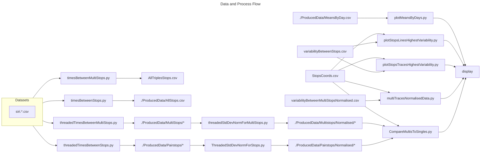

# FinalYearProject

```mermaid
---
title: Data and Process Flow
---
graph LR

./ProducedData/MeansByDay.csv --> plotMeansByDays.py --> display
StopsCoords.csv & variabilityBetweenStops.csv --> plotStopsLinesHighestVariability.py --> display
subgraph Datasets
    siri.*.csv
end

Datasets --> timesBetweenMultiStops.py --> AllTriplesStops.csv

Datasets --> timesBetweenStops.py --> ./ProducedData/AllStops.csv

StopsCoords.csv & variabilityBetweenStops.csv --> plotStopsTracesHighestVariability.py --> display 

Datasets --> threadedTimesBetweenStops.py --> ./ProducedData/Pairstops/*

Datasets --> threadedTimesBetweenMultiStops.py --> ./ProducedData/MultiStops/*

./ProducedData/MultiStops/* --> threadedStdDevNormForMultiStops.py --> ./ProducedData/Multistops/Normalised/*

./ProducedData/Pairstops/* --> ThreadedStdDevNormForStops.py --> ./ProducedData/Pairstops/Normalised/*

StopsCoords.csv & variabilityBetweenMultiStopsNormalised.csv--> multiTracesNormalisedData.py --> display

StopsCoords.csv & ./ProducedData/Multistops/Normalised/* & ./ProducedData/Pairstops/Normalised/* --> CompareMultisToSingles.py --> display
```
