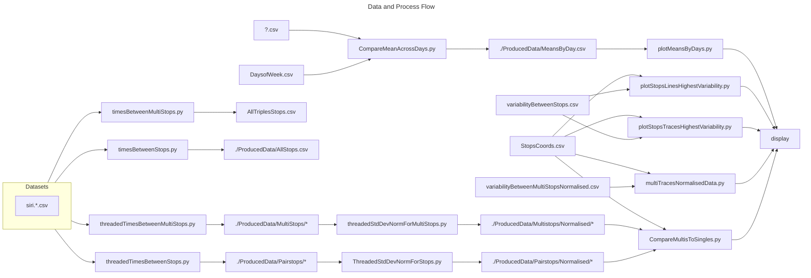
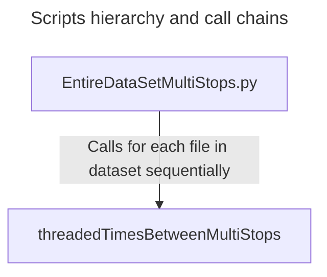

# A Data Analysis of Bus Journey Variability in Dublin

The following project was a data analysis of GPS data points from Dublin Buses over a 24 day
period in November 2012 undertaken as my Final Year Project for my BA.(Mod) in Trinity College Dublin in 2020.

The aim of the analysis was to transform the raw data into some form of human readable metrics from which conclusions could be drawn and comparisons made regarding the Journey Time Variability and performance of Buses in the Dublin Area.

The raw GPS data is taken and turned into information regarding the travel times between stops across the city. This information is then used to generate statistical metrics regarding the performance of all journeys on a stretch-by-stretch basis. The primary metrics used were mean travel time for a stretch and the Standard Deviation for all journeys on a particular stretch.

Using the generated statistics visual representations of these statistics were produced to allow comparison between various stretches and across days during the sample period.

The goal going forward will be to refactor this repository to be explorable, to do so, Jupyter notebooks will be used to be viewed in browser or downloaded by anyone interested in exploring.

A [PDF copy of the Final Dissertation](./Dissertation%20and%20College%20Materials/TCD_FYP_Dissertation_Owen_Duffy%20(1).pdf) is included.

**Note:** Since the completion of the dissertation the file structure was rearranged for neatness without consideration for running scripts. Therefore the scripts have not been modified to account for their new locations and as such will not work out of the box.

Below diagram illustrates the manner of how data is processed and how scripts are applied and create new datasets. Not all scripts and data transformations are included.

