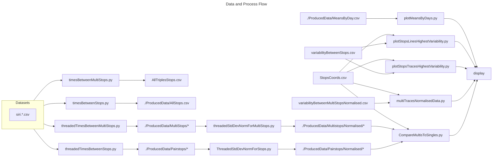

# A Data Analysis of Bus Journey Variability in Dublin

Code Repository for Final Year Project for BA.(Mod) Trinity College Dublin by OwenKDuffy

The goal going forward will be to refactor this repository to be explorable, to do so, Jupyter notebooks will be used to be viewed in browser or downloaded by anyone interested in exploring.

A PDF copy of the Final Dissertation is included [here](./TCD_FYP_Dissertation_Owen_Duffy (1).pdf)

**Note:** Since the completion of the dissertation the file structure was rearranged for neatness without consideration for running scripts. Therefore the scripts have not been modified to account for their new locations and as such will not work out of the box.

Below diagram illustrates the manner of how data is processed and how scripts are applied and create new datasets. Not all scripts and data transformations are included.

